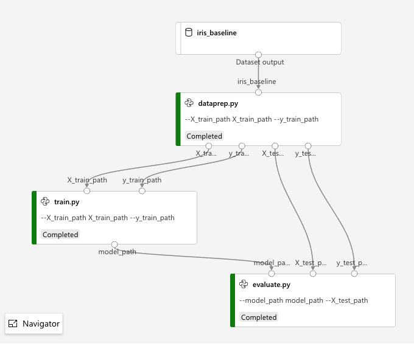

# A Simple 3-Step AzureML Pipeline (Dataprep, Training, and Evaluation)



This demonstrates how you create a multistep AzureML pipeline using a series of `PythonScriptStep` objects. 

In this case, the calculation is extremely trivial: predicting Iris species using scikit-learn's Gaussian Naive Bayes. This pipeline could be solved (very quickly) using this code: 

```python
import pandas as pd
from sklearn.naive_bayes import GaussianNB
from sklearn.model_selection import train_test_split
from sklearn.metrics import accuracy_score

# These two lines become the data ingestion and dataprep steps 
df = pd.read_csv("iris.csv", header=None)
X_train, X_test, y_train, y_test = train_test_split(df.iloc[:,1:4], df.iloc[:,4:5], test_size=0.2, random_state=42)

# These two lines become the training step
model = GaussianNB()
model.fit(X_train, y_train.values.ravel())

# These two lines become the evaluation step
prediction = model.predict(X_test)
print(f'Accuracy: {accuracy_score(prediction, y_test):3f}')
```

The point of this notebook is to show the construction of the AzureML pipeline, not demonstrate any kind of complex machine learning. 

## Use

You'll need an Azure Machine Learning workspace and the `config.json` used to help you authenticate to it. (See [Create and manage Azure Machine Learning workspaces in Azure portal](https://docs.microsoft.com/azure/machine-learning/how-to-manage-workspace))

* Put `config.json` in the directory that contains [Simplest Possible Pipeline.ipynb](Simplest Possible Pipeline.ipynb)
* Create and activate a virtual environment that contains the [AzureML Python SDK](https://docs.microsoft.com/python/api/overview/azure/ml/install?view=azure-ml-py) and [Jupyter](jupyter.org)
* Run `jupyter notebook` 
* Open `Simplest Possible Pipeline.ipynb`
* Execute all cells

Technically, this isn't the _simplest_ possible pipeline, since you can create a pipeline that has a single step and, I suppose, no inputs or outputs. This is more like a skeleton or template of the simplest _reasonable_ pipeline, that divvies up the machine learning task into:

1. Data ingestion
1. Data preparation
1. Training
1. Evaluation

